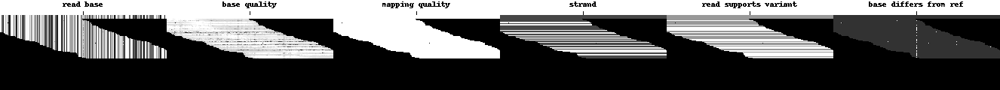
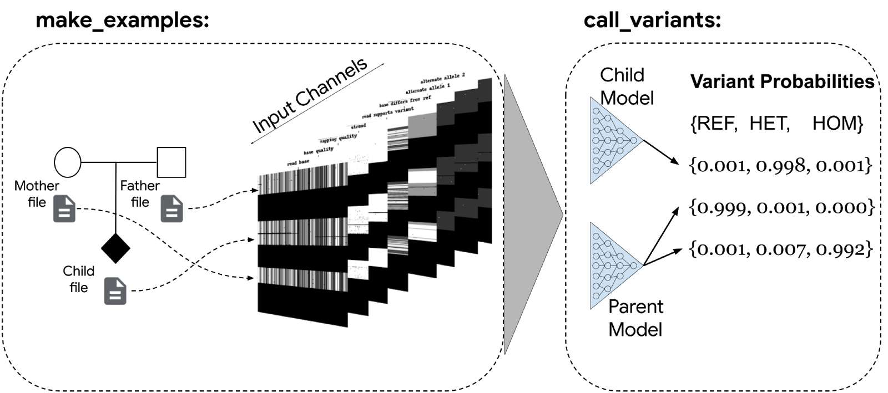

## 7.[DeepVariant](https://github.com/google/deepvariant)

说明文档：https://google.github.io/deepvariant/posts/2020-02-20-looking-through-deepvariants-eyes/

三分类：three-state (hom-ref, het, hom-alt) 

图像(100, 221, 6) corresponding to (height, width, channels)

6 channels:

        Read base: different intensities represent A, C, G, and T.
    
        Base quality: set by the sequencing machine. White is higher quality.
    
        Mapping quality: set by the aligner. White is higher quality.
    
        Strand of alignment: Black is forward; white is reverse.
    
        Read supports variant: White means the read supports the given alternate allele, grey means it does not.
    
        Base differs from ref: White means the base is different from the reference, dark grey means the base matches the reference.
    
221 width:

        以变异位点为中心，左右碱基位置的跨度：221代表的窗口宽度

100 height:

        以变异位点为中心，过滤变异掉不可用reads,然后将剩下的reads按照行转化为图片
        filter away any unusable reads (see is_usable_read() below) if a read is
        marked as a duplicate, if it is marked as failing vendor quality checks, if it is not
        aligned or is not the primary alignment, if its mapping quality is less than 10, or
        if it is paired and not marked as properly placed. We further only include read
        bases as potential alleles if all of the bases in the alleles have a base quality ≥10.
        We emit variant calls only at standard (ACGT) bases in the reference genome.
        It is possible to force candidate variants to be emitted (randomly with prob-
        ability of p) at sites with no alternate alleles, which are used as homozygous
        reference training sites. There is no constraint on the size of indels emitted,
        so long as the exact position and bases are present in the CIGAR string and
        they are consistent across multiple reads

        image = Image(WIDTH, HEIGHT)
        row_i = fill_reference_pixels(ref, image)
        for read in reads.get_overlapping(start, end):
        if row_i < HEIGHT and is_usable_read(read): 
            add_read(image, read, row_i)
            row_i += 1
        yield image

示例

[Poplin R, Chang P C, Alexander D, et al. A universal SNP and small-indel variant caller using deep neural networks[J]. Nature biotechnology, 2018, 36(10): 983-987.](https://www.nature.com/articles/nbt.4235)
