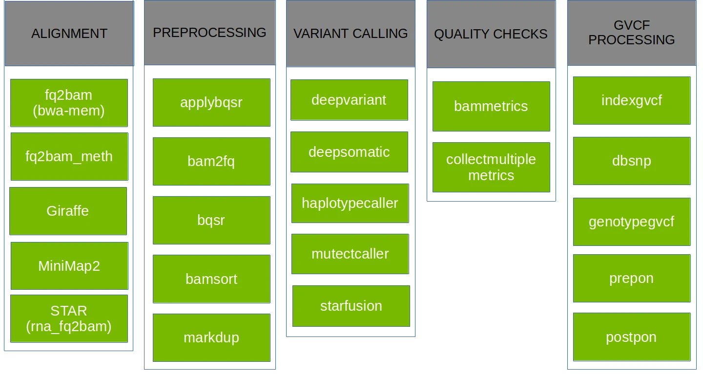
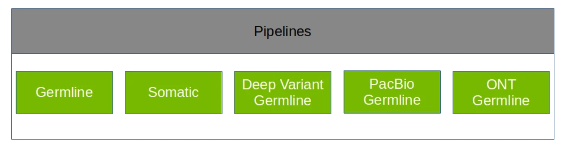
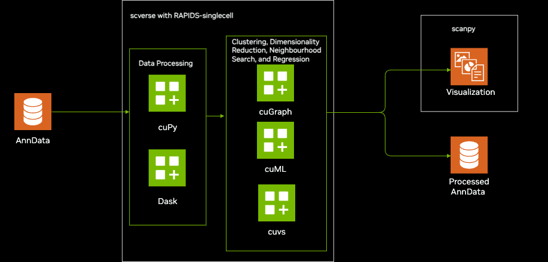

# 1.NVIDIA数据中心与AI计算GPU产品总览（按发布年份排序）

| 年份 | 架构 | 产品型号 | 核心定位与关键特性 |
|:---|:---|:---|:---|
| **2025** | **Blackwell** | **B300** | 下一代旗舰芯片，288GB HBM3e，支持FP4/FP6精度，面向更大模型 |
| | **Blackwell** | **B200** | 万亿参数模型专用，192GB HBM3e，FP16算力2.3PetaFLOPS，第二代Transformer引擎 |
| | **Blackwell** | **GB200** | CPU-GPU超级芯片，Grace CPU + 双B200 GPU，革命性统一内存架构 |
| **2024** | **Hopper** | **H200** | LLM推理与HPC优选，141GB HBM3e显存升级，FP16算力989 TFLOPS |
| | **Hopper** | **H20** | 中国市场特供合规版，96GB HBM3，符合出口管制要求 |
| | **Ada Lovelace** | **L40S** | 生成式AI与渲染加速，48GB GDDR6，专业级AI优化设计 |
| **2023** | **Hopper** | **H100** | 划时代AI训练旗舰，80GB HBM3，首款Transformer引擎支持FP8精度 |
| **2022** | **Ada Lovelace** | **L40** | Omniverse与专业渲染专用，48GB GDDR6，专注图形仿真 |
| | **Ada Lovelace** | **L4** | 边缘推理与视频加速，24GB GDDR6单槽低功耗，高能效设计 |
| | **Grace Hopper** | **GH200** | 首个CPU-GPU超级芯片，统一内存架构开创者 |
| **2020** | **Ampere** | **A100** | 通用AI/HPC黄金标准，80GB HBM2e，首创MIG多实例技术 |
| | **Ampere** | **A40** | 可视化与计算融合，48GB GDDR6带显示输出，vWS/渲染 |
| | **Ampere** | **A30** | 主流推理与训练，24GB HBM2，高性价比MIG支持 |
| | **Ampere** | **A10** | 图形与AI推理融合，24GB GDDR6，云游戏/虚拟化 |
| | **Ampere** | **A16** | 高密度VDI专用，4×16GB GDDR6，四芯片整合设计 |

# 2.Parabricks 

## 2-1:supports the tools

## 2-2.variant calling pipelines

## 2-3:Hardware Requirements

      T4

      A10, A30, A40, A100, A6000

      L4, L40

      H100, H200

      GH200

      B200, B300

      GB200, GB300

      RTX PRO 6000 Blackwell Server Edition

# 3.Single-Cell Analysis

# 4.reference

[Zhu T, Vats P, Onken S, et al. Parabricks: GPU Accelerated Universal Pan-Instrument Genomics Analysis Software Suite[J]. bioRxiv, 2025: 2025.07. 23.666378.](https://www.biorxiv.org/content/10.1101/2025.07.23.666378v2.abstract)

[Samarakoon P S, Fournous G, Hansen L T, et al. Benchmarking accelerated next-generation sequencing analysis pipelines[J]. Bioinformatics Advances, 2025, 5(1): vbaf085.](https://academic.oup.com/bioinformaticsadvances/article/5/1/vbaf085/8132977)

https://www.nvidia.com/en-us/industries/healthcare-life-sciences/genomics/
