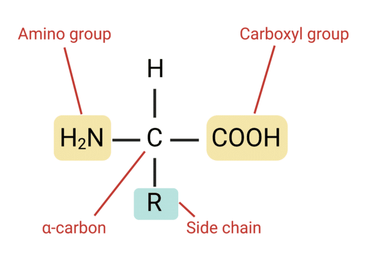

## [PrimateAI-3D](https://primateai3d.basespace.illumina.com)

    PrimateAI-3D三分类问题：common variants、unknown human variants、pathogenicity

[Gao H, Hamp T, Ede J, et al. The landscape of tolerated genetic variation in humans and primates[J]. Science, 2023, 380(6648): eabn8153.](https://www.science.org/doi/10.1126/science.abn8197)

## 1.神经网络在机器学习中的核心应用
| 任务类型               | 典型神经网络架构                          | 代表性模型/应用                                       | 实际落地场景举例                              |
|------------------------|-------------------------------------------|-------------------------------------------------------|-----------------------------------------------|
| 图像分类与识别         | CNN（卷积神经网络）                       | ResNet, EfficientNet, ViT                             | 手机人脸解锁、安防监控、医疗影像诊断         |
| 目标检测               | CNN + Region Proposal / Transformer       | YOLO系列、Faster R-CNN、DETR                          | 自动驾驶视觉、超市无人结算、缺陷检测          |
| 图像分割               | U-Net、FCN、SegFormer                     | SAM（Segment Anything Model）、DeepLab               | 医学影像肿瘤分割、卫星图像土地分类            |
| 自然语言处理（NLP）    | Transformer                               | BERT、GPT系列、LLaMA、ChatGPT、Grok、Qwen             | 机器翻译、聊天机器人、搜索引擎、文生图提示   |
| 多模态大模型           | Transformer + 视觉编码器                  | GPT-4o、Gemini、LLaMA-3-V、Qwen-VL、Claude            | 看图说话、视觉问答、文档理解、多模态搜索      |
| 语音识别与合成         | RNN、Transformer、Conformer               | Whisper、WaveNet、VALL-E                              | 实时语音转文字、Siri、客服语音机器人、小爱同学|
| 推荐系统               | 深度因子分解机 + DNN、Transformer         | YouTube推荐、淘宝/抖音推荐、Netflix                    | 短视频feed、电商推荐、音乐推荐                |
| 时间序列预测           | RNN、LSTM、Transformer                    | DeepAR、Informer、Temporal Fusion Transformer         | 股价预测、电力负荷预测、天气预报              |
| 生成模型               | GAN、扩散模型（Diffusion）、自回归        | Stable Diffusion、DALL·E 3、Sora、Midjourney          | AI绘画、视频生成、图像超分辨率、艺术创作      |
| 强化学习               | DQN、PPO + 神经网络策略                   | AlphaGo、ChatGPT RLHF、机器人控制                     | 游戏AI、工业机器人路径规划、自动驾驶决策      |
| 图神经网络（GNN）      | GCN、GraphSAGE、Graph Transformer         | AlphaFold 3、推荐系统中的关系推理                     | 蛋白质结构预测、知识图谱、社交网络分析        |
| 科学计算与模拟         | Neural Operator、PINN                     | DeepONet、Fourier Neural Operator                     | 气候建模、流体力学模拟、材料发现              |

### 1-1:CNN 的三大核心操作
CNN 用可学习的局部滤波器（卷积核）+ 下采样（池化）+ 非线性激活，层层抽象出从边缘→纹理→部件→整体物体的层次化特征，最终实现高效的图像理解。

| 操作          | 数学符号      | 作用                                   | 直观理解                              |
|---------------|---------------|----------------------------------------|---------------------------------------|
| 1. 卷积       | ∗ 或 ⊛        | 用小滤波器扫描整张图，提取局部特征     | “用不同模板去擦”图像，擦出边缘、纹理等 |
| 2. 池化 Pooling | Max/Avg       | 下采样，压缩空间尺寸，增加感受野       | 把 2×2 区域“浓缩”成一个代表值        |
| 3. 激活函数   | ReLU、GELU 等 | 引入非线性，让网络能拟合复杂函数       | 把负值变 0，保留强信号                |

### 1-2:一个典型 CNN 的完整流程（以分类为例）
    输入图像 (H×W×3)
        ↓ 卷积 + ReLU → 特征图1 (很多通道)
        ↓ 池化 → 降采样
        ↓ 卷积 + ReLU → 特征图2（更抽象）
        ↓ 池化
        ↓ …… 重复几次
        ↓ 全局平均池化（GAP）或 Flatten
        ↓ 全连接层（1~2层）
        ↓ Softmax → 1000 类概率（比如 ImageNet）

## 2:蛋白质三维结构的层次构成

| 层次 | 名称 | 内容 | 关键作用 |
|------|------|------|----------|
| 一级结构 | Primary structure | 氨基酸序列（线性排列） | 决定后续折叠和一级顺序，为更高层次结构提供基础 |
| 二级结构 | Secondary structure | 局部折叠单元，例如 α-螺旋（α-helix）、β-折叠（β-sheet）、转角（turn）等 | 稳定局部构象，主要由主链间氢键维持 |
| 三级结构 | Tertiary structure | 整个多肽链的三维折叠与结构域（domain）排列 | 决定蛋白功能位点和整体功能形态 |
| 四级结构 | Quaternary structure | 多条多肽链（亚基）通过相互作用组装形成复合体 | 实现多亚基协同、调控与复杂功能（例如血红蛋白） |

## 3:氨基酸的结构详解

### 3-1:氨基酸的基本结构

每个氨基酸分子包含一个中心α-碳原子（Cα,是每个氨基酸主链上的“中心碳原子”,主链位置Backbone,表示“这个残基在蛋白里的位置”），连接四个基团：

    氨基(-NH₂):带正电荷的基团
    羧基(-COOH):带负电荷的基团
    氢原子(H)
    侧链(R基团)决定氨基酸的种类和性质

通用化学式：

### 3-2. 侧链差异：20种标准氨基酸

侧链（Side Chain 或 R-Group）：这是氨基酸之间唯一的区别所在。侧链的结构、大小、电荷和亲疏水性决定了每种氨基酸的独特化学性质。 20 种标准氨基酸的侧链R基团差异巨大，这也是它们在蛋白质三维结构和功能中发挥不同作用的关键。

Cβ 是侧链上的第一个碳原子,侧链指向Side-chain orientation,表示“这个残基的侧链指向和功能”。

甘氨酸（Glycine）：侧链仅为 -H，没有 Cβ（侧链无碳原子）

### 2-1:PDB 文件核心结构

## 3.三维数据表示、文件格式与机器学习应用

## 🌐 三维数据表示、文件格式与机器学习应用

| 数据表示 | 核心结构特点 | 典型文件格式 | 机器学习挑战 | 关键网络结构 | 典型应用场景 |
| :--- | :--- | :--- | :--- | :--- | :--- |
| **1. 点云 (Point Cloud)** | 无序、不规则的离散点集 (x, y, z) | **.LAS** / **.LAZ**, **.PCD**, .XYZ | **无序性**（置换不变性），缺乏拓扑结构。 | PointNet, PointNet++, DGCNN | 语义分割、自动驾驶目标检测、LiDAR 数据处理。 |
| **2. 网格 (Mesh)** | 顶点、边、面构成的结构化表面。 | **.OBJ**, **.STL**, .FBX, .PLY | **拓扑不规则性**（顶点邻域不同），难以直接应用传统 CNN。 | MeshCNN (边缘卷积), 图卷积网络 (GCN) | 3D 打印、形状形变、人脸/人体模型动画。 |
| **3. 体素化 (Voxelization)** | 三维规则网格的离散占用/值。 | **自定义数组** (.npz, .h5), .NII | **高维稀疏性**（大量内存消耗），计算效率低。 | 3D CNN, **稀疏卷积**, Octree-based Networks | 粗粒度形状识别、体积分析、医疗影像体数据处理。 |
| **4. 隐式表示 (Implicit Field)** | 使用连续函数（MLP）定义空间点的属性 (SDF/密度)。 | **模型权重文件** (.pth, .ckpt), **.ndf** | **函数拟合**的复杂性，需要高容量网络捕获细节。 | NeRF (神经辐射场), Occupancy Networks, DeepSDF | 高保真 3D 重建、**新视图合成**、拓扑灵活的形状生成。 |

## 4.处理三维数据的常见 Python 模块列表
| 类别 | 模块名称 | 核心功能和用途 |
| :--- | :--- | :--- |
| **基础数值/计算** | **NumPy / SciPy** | 基础科学计算、高效的数组操作，是所有 3D 数据处理的底层依赖。 |
| **点云/几何处理** | **Open3D** | 功能全面的 3D 数据处理库，支持点云、网格的滤波、配准、重建、分割和可视化。 |
| **网格处理/CAD** | **Trimesh** | 专注于高效处理和分析**三角形网格**，支持体素化、布尔运算、截面切割。 |
| **科学可视化** | **PyVista** | 基于 VTK，专注于高性能的**科学可视化**，适用于网格、点云和体积数据。 |
| **基础可视化** | **Matplotlib (mplot3d)** | 基础的 3D 绘图扩展，用于绘制简单的三维散点图和曲面图。 |
| **深度学习/GNN** | **PyTorch / TensorFlow** | 深度学习框架，用于构建 3D 卷积网络 (3D CNN) 或处理体素化后的张量。 |
| **深度学习/GNN** | **PyTorch Geometric (PyG)** | 专注于图神经网络 (GNN) 和非结构化 3D 数据（如点云）的处理。 |
| **生物结构解析** | **Biopython / MDAnalysis** | 用于读取和解析 PDB/mmCIF 等生物大分子结构文件，提取原子坐标。 |

## 5.Voxelize（体素化）

是一个计算机图形学和计算生物学中的关键过程，指将连续的3D对象（如几何模型、点云或分子结构）转换为离散的体素（voxel）网格表示。体素是3D空间中的“像素”——体积元素（volume element）的缩写，通常是一个立方体小块，类似于2D图像中的像素，但扩展到三维。

PrimateAI-3D 选择了：

1 Å = 10⁻¹⁰ 米 = 0.1 纳米（nm）

| 参数 (Parameter) | 值 (Value) |
|------------------|-------------|
| 体素网格大小 (Voxel grid size) | 7 × 7 × 7 |
| 单个体素尺寸 (Voxel size)  |2 Å × 2 Å × 2 Å |
| 立方体真实物理范围 (Physical cube size) | 14 Å × 14 Å × 14 Å |
| 网格中心 (Grid center) | 目标突变残基的 Cα (Cα of target residue) |
| 体素总数 (Total voxels) | 343 (7³) |
| 是否固定形状 (Fixed tensor shape) | 是（用于神经网络输入） |
