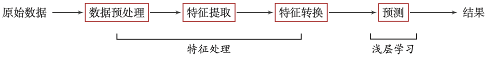
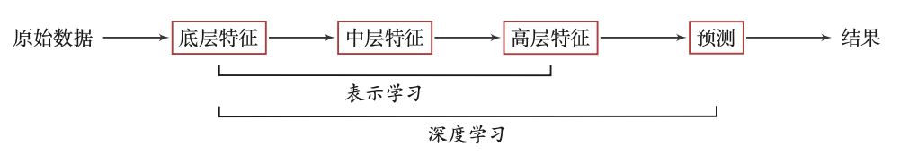
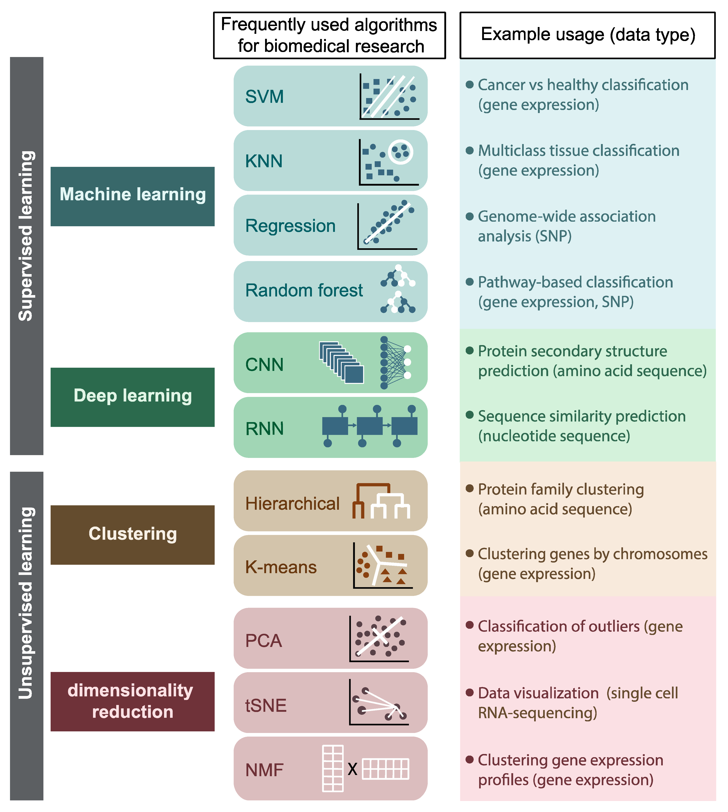
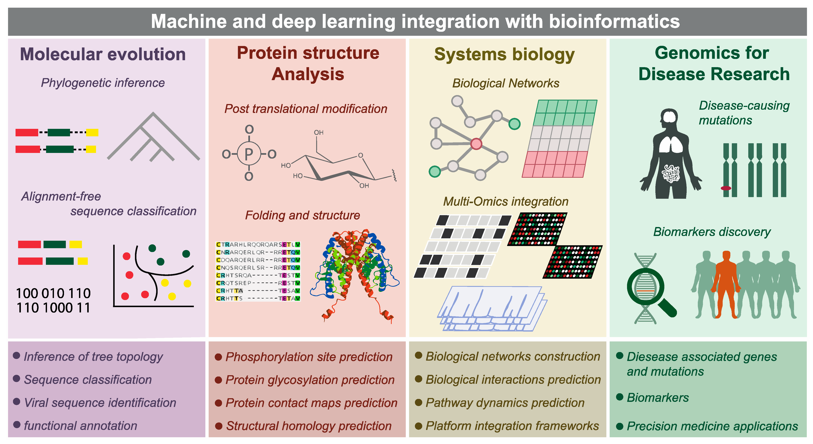

# 机器学习

## 1.传统机器学习的数据处理流程

## 2.深度学习的数据处理流程

为了学习一种好的表示，需要构建具有一定“深度”的模型，并通过学习算法 来让模型自动学习出好的特征表示(从底层特征，到中层特征，再到高层特征)， 
从而最终提升预测模型的准确率.所谓“深度”是指原始数据进行非线性特征转换的次数.深度学习采用的模型主要是*神经网络模型*

## 3.机器学习分类主要有

|学习类型| 	数据要求          | 	任务类型  |	主要用途|
|-------|----------------|--------|-|
|监督学习	| 大量带标签数据        | 	分类(Classification)、回归(Regression)	 |明确的预测任务|
|无监督学习	| 仅需无标签数据        | 	聚类(Clustering)、降维(DimensionalityReduction)|模式发现、数据结构探索|
|半监督学习	| 少量标签 + 大量无标签数据 | 	分类	   |在标签稀缺但无标签丰富的场景|

| 模型类型 | 代表模型 | 适用场景 | 优点 | 缺点 |
| :--- | :--- | :--- | :--- | :--- |
| **线性模型** | 线性回归、逻辑回归 | **简单、可解释**的回归和分类问题。如：房价预测、邮件分类。 | 快速、易于理解、可解释性强。 | 难以处理非线性关系。 |
| **基于树的模型** | 决策树、随机森林、XGBoost、LightGBM、CatBoost | **结构化/表格数据**，需要高准确率、能自动处理非线性关系。 | 准确率高、能处理非线性数据、不需要归一化。 | 单一决策树容易过拟合；集成模型解释性差。 |
| **支持向量机** | SVC、SVR | **中等规模数据**，尤其是在**高维空间**中需要高效分类。 | 在高维空间表现好、泛化能力强。 | 当数据集非常大时，训练速度会很慢；对参数选择和数据归一化敏感。 |
| **神经网络** | MLP、CNN、RNN | **非结构化数据**，如图像、文本、语音。 | 在图像、文本等领域表现卓越、能学习复杂特征。 | 需要大量数据、计算成本高、解释性差。 |

## 4:[scikit-learn:A set of python modules for machine learning and data mining](https://scikit-learn.org/stable/)
是一个通用的机器学习库，提供了包括分类、回归、聚类等在内的一系列传统机器学习算法。它更侧重于特征工程，需要用户自行对数据进行处理，如选择特征、压缩维度、转换格式等
适合中小型、实用的机器学习项目，尤其是那些数据量不大但需要手动处理数据并选择合适模型的项目。这类项目往往在CPU上就可以完成，对硬件要求相对较低。

### 学习笔记

- [1.target分布](demo_project/4-1.target_distribution.ipynb) 
- [2.数据缺失](demo_project/4-2.NA.ipynb) 
- [3.特征选取](demo_project/4-3.Feature_Selection.ipynb) 
- [4.树模型](demo_project/4-4.Tree-based-Algorithms.ipynb)

## 5:[TensorFlow:an open source machine learning framework for everyone](https://www.tensorflow.org/?hl=zh-cn)
由Google公司开发的 **深度学习框架**，可以在任意具备CPU或者GPU的设备上运行.
TensorFlow 的计算过程使用数据流图来表示.TensorFlow 的名字来源于其计算过程中的操作对象为多维数组，即张量(Tensor).
TensorFlow 1.0 版本采用静态计算图，2.0 版本之后也支持动态计算图.

### 学习笔记

- [1.TensorFlow 决策森林](demo_project/5-1.tensorflow_decision_forests.ipynb)
- [2.MNIST:深度学习的hello word](demo_project/5-2.mnist.ipynb)

## 6:[PyTorch](https://pytorch.ac.cn)
由Facebook、NVIDIA、Twitter等公司开发维护的**深度学习框架**，其前身为Lua语言的Torch.
PyTorch也是基于动态计算图的框架，在需要动态改变神经网络结构的任务中有着明显的优势.

## 7.软件安装
<pre>
# scikit-learn
pip3 install -U scikit-learn

# tensorflow_decision_forests 附带安装tensorflow、pandas、numpy
pip3 install tensorflow_decision_forests --upgrade

# seaborn: statistical data visualization 附带安装matplotlib
pip3 install seaborn
</pre>

## 8.生物信息学

[Auslander N, Gussow A B, Koonin E V. Incorporating machine learning into established bioinformatics frameworks[J]. International journal of molecular sciences, 2021, 22(6): 2903.](https://www.mdpi.com/1422-0067/22/6/2903)

### 8-1.机器学习

### 8-2.深度学习

Google(**DeepVariant、AlphaMissense**)与Illumina(**PrimateAI-3D**)开发的生物信息工具都利用了，卷积神经网络(**Convolutional Neural Network,CNN 或 ConvNet**)

- [Nucleus](./NGS/Nucleus/README.md)

- [DeepVariant](./NGS/DeepVariant/README.md)

- [AlphaMissense](./NGS/AlphaMissense/README.md)

- [PrimateAI-3D](./NGS/PrimateAI-3D/README.md)

## 9.学习资源

[菜鸟教程:Sklearn 教程](https://www.runoob.com/sklearn/sklearn-tutorial.html)

[scikit-learn中文社区](https://scikit-learn.org.cn)

[TensorFlow中文网](https://www.tensorflow.org/?hl=zh-cn)

[Google 机器学习教育](https://developers.google.com/machine-learning?hl=zh-cn)

[2025 Stanford CS230:Deep learning](https://cs230.stanford.edu/syllabus/)

[CS231n: Deep Learning for Computer Vision](https://cs231n.github.io)

[Kaggle](https://www.kaggle.com)

[UC Irvine Machine Learning Repository](https://archive.ics.uci.edu)

[Data Science and Data Mining courses at the University of Central Florida.](https://stars.library.ucf.edu/data-science-mining/)
