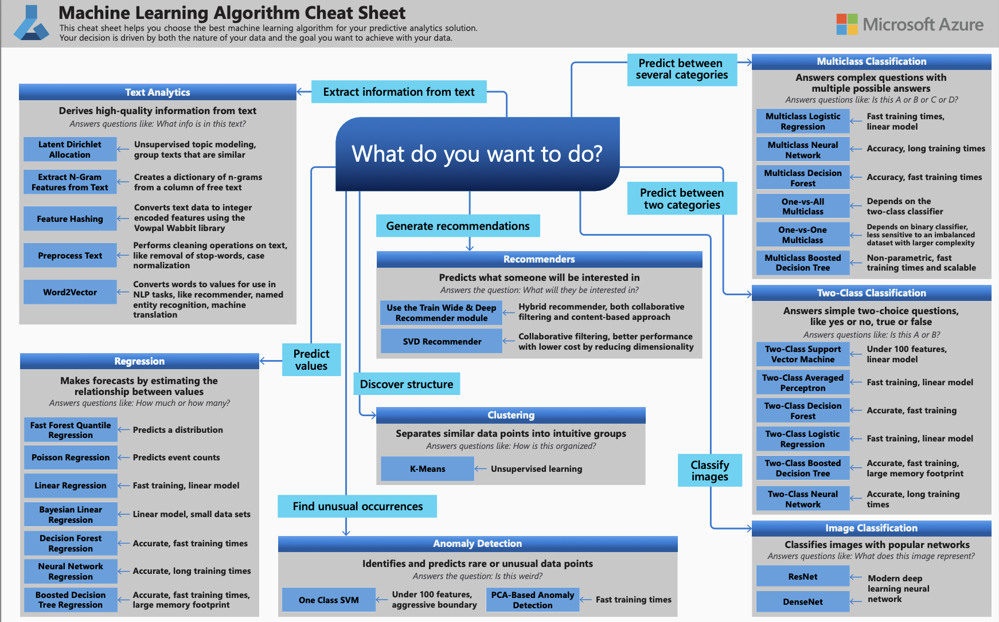
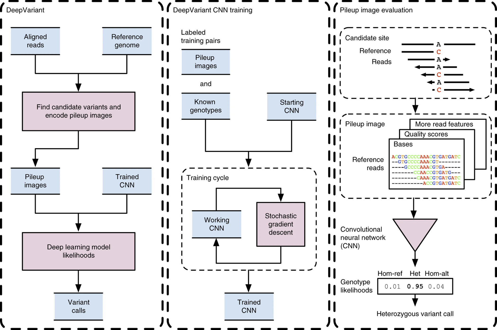
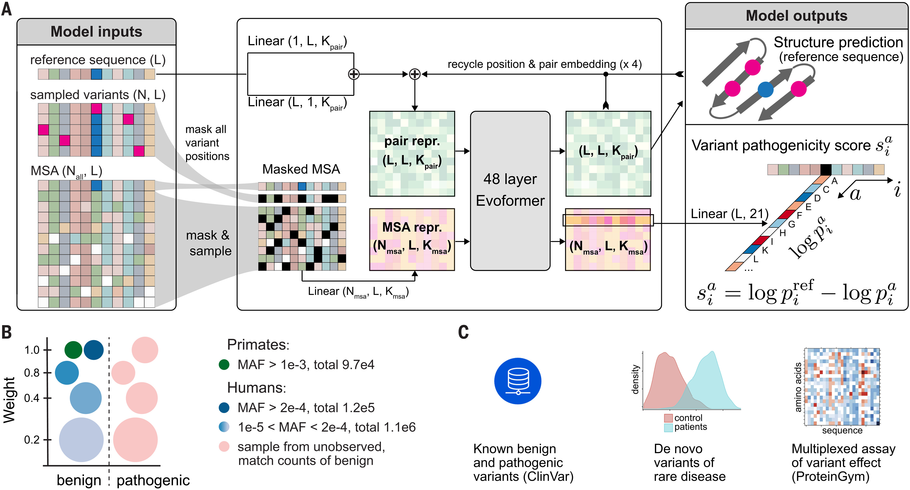

# 机器学习-学习笔记

## 1.传统机器学习的数据处理流程

## 2.深度学习的数据处理流程

为了学习一种好的表示，需要构建具有一定“深度”的模型，并通过学习算法 来让模型自动学习出好的特征表示(从底层特征，到中层特征，再到高层特征)， 
从而最终提升预测模型的准确率.所谓“深度”是指原始数据进行非线性特征转换的次数.深度学习采用的模型主要是*神经网络模型*

## 3.机器学习分类主要有

|学习类型| 	数据要求          | 	任务类型  |	主要用途|
|-------|----------------|--------|-|
|监督学习	| 大量带标签数据        | 	分类(Classification)、回归(Regression)	 |明确的预测任务|
|无监督学习	| 仅需无标签数据        | 	聚类(Clustering)、降维(DimensionalityReduction)|模式发现、数据结构探索|
|半监督学习	| 少量标签 + 大量无标签数据 | 	分类	   |在标签稀缺但无标签丰富的场景|

| 模块   |	解释	|常用算法	|常见应用|
|------|----------------|--------|-|
| 分类	  |识别某对象属于哪个类别|	SVM、最近邻、随机森林|	垃圾邮件识别、图像识别|
| 回归	  |预测目标变量的连续值|	线性回归、SVR、随机森林回归|	房价预测、温度预测、销售预测|
| 聚类	  |将相似的数据划分到同一组|	K均值、DBSCAN、层次聚类|	客户分群、图像分割、基因表达分析|
| 降维	  |减少特征维度，保留数据主要信息|	PCA、SVD、Kernel PCA|	数据可视化、数据压缩、特征提取|
| 模型选择 |	选择性能最优的模型或参数|	网格搜索、随机搜索、交叉验证|	模型优化、性能评估、超参数调整|
| 预处理  |	对数据进行清理、变换或编码，便于模型使用|	标准化、归一化、编码、缺失值填补|	数据归一化、分类特征处理、缺失值填补|

## 4.[scikit-learn](https://scikit-learn.org)

scikit-learn是一个通用的机器学习库，提供了包括分类、回归、聚类等在内的一系列传统机器学习算法。它更侧重于特征工程，需要用户自行对数据进行处理，如选择特征、压缩维度、转换格式等
适合中小型、实用的机器学习项目，尤其是那些数据量不大但需要手动处理数据并选择合适模型的项目。这类项目往往在CPU上就可以完成，对硬件要求相对较低。

## 5.[TensorFlow](https://www.tensorflow.org/?hl=zh-cn) and [PyTorch](https://pytorch.ac.cn)

**TensorFlow**:由 Google 公司开发的**深度学习框架**，可以在任意具备CPU或者GPU的设备上运行.
TensorFlow 的计算过程使用数据流图来表示.TensorFlow 的名字来源于其计算过程中的操作对象为多维数组，即张量(Tensor).
TensorFlow 1.0 版本采用静态计算图，2.0 版本之后也支持动态计算图.

**PyTorch**:由 Facebook、NVIDIA、Twitter等公司开发维护的**深度学习框架**，其前身为Lua语言的Torch.
PyTorch也是基于动态计算图的框架，在需要动态改变神经网络结构的任务中有着明显的优势.

Google(**DeepVariant、AlphaMissense**)与Illumina(**PrimateAI-3D**)开发的生物信息工具都利用了，
卷积神经网络(**Convolutional Neural Network,CNN 或 ConvNet**)

## 6.[Nucleus](https://github.com/google/nucleus)
学习视频：https://www.youtube.com/watch?v=ichunwqCpe8, 将比对文件图像化

## 7.[DeepVariant](https://github.com/google/deepvariant)

说明文档：https://google.github.io/deepvariant/posts/2020-02-20-looking-through-deepvariants-eyes/

三分类：three-state (hom-ref, het, hom-alt) 

图像(100, 221, 6) corresponding to (height, width, channels)

6 channels:

        Read base: different intensities represent A, C, G, and T.
    
        Base quality: set by the sequencing machine. White is higher quality.
    
        Mapping quality: set by the aligner. White is higher quality.
    
        Strand of alignment: Black is forward; white is reverse.
    
        Read supports variant: White means the read supports the given alternate allele, grey means it does not.
    
        Base differs from ref: White means the base is different from the reference, dark grey means the base matches the reference.
    
221 width:

        以变异位点为中心，左右碱基位置的跨度：221代表的窗口宽度

100 height:

        以变异位点为中心，过滤变异掉不可用reads,然后将剩下的reads按照行转化为图片
        filter away any unusable reads (see is_usable_read() below) if a read is
        marked as a duplicate, if it is marked as failing vendor quality checks, if it is not
        aligned or is not the primary alignment, if its mapping quality is less than 10, or
        if it is paired and not marked as properly placed. We further only include read
        bases as potential alleles if all of the bases in the alleles have a base quality ≥10.
        We emit variant calls only at standard (ACGT) bases in the reference genome.
        It is possible to force candidate variants to be emitted (randomly with prob-
        ability of p) at sites with no alternate alleles, which are used as homozygous
        reference training sites. There is no constraint on the size of indels emitted,
        so long as the exact position and bases are present in the CIGAR string and
        they are consistent across multiple reads

        image = Image(WIDTH, HEIGHT)
        row_i = fill_reference_pixels(ref, image)
        for read in reads.get_overlapping(start, end):
        if row_i < HEIGHT and is_usable_read(read): 
            add_read(image, read, row_i)
            row_i += 1
        yield image

示例

[Poplin R, Chang P C, Alexander D, et al. A universal SNP and small-indel variant caller using deep neural networks[J]. Nature biotechnology, 2018, 36(10): 983-987.](https://www.nature.com/articles/nbt.4235)

## 8.[AlphaMissense](https://github.com/google-deepmind/alphamissense)

### Overview of AlphaMissens

[Cheng J, Novati G, Pan J, et al. Accurate proteome-wide missense variant effect prediction with AlphaMissense[J]. Science, 2023, 381(6664): eadg7492.](https://www.science.org/doi/10.1126/science.adg7492)

## 9.[PrimateAI-3D](https://primateai3d.basespace.illumina.com)

    PrimateAI-3D三分类问题：common variants、unknown human variants、pathogenicity

[Gao H, Hamp T, Ede J, et al. The landscape of tolerated genetic variation in humans and primates[J]. Science, 2023, 380(6648): eabn8153.](https://www.science.org/doi/10.1126/science.abn8197)

## 9.[ImageNet](https://www.image-net.org/update-mar-11-2021.php)

项目由李飞飞（Fei-Fei Li）教授领导，她是斯坦福大学的计算机科学教授，人工智能领域的知名学者。李飞飞教授与她的团队一起创建了ImageNet，目的是为计算机视觉领域提供一个大规模的、带标签的图像数据集，推动机器学习和深度学习技术在图像识别上的发展。
是一个大型的图像数据库，广泛用于计算机视觉领域，特别是在训练和评估深度学习模型（如卷积神经网络，CNN）时。它包含了超过 1400 万张带标签的图像，涵盖了大约 2 万多个不同的类别，包含各种各样的物体，如动物、植物、建筑、交通工具等。

ImageNet 最著名的贡献之一是 ImageNet大规模视觉识别挑战赛（ILSVRC），这是一个年度竞赛，旨在测试图像分类和目标检测模型的性能。该竞赛自 2010年开始，每年都会吸引众多研究者提交他们的模型，推动了深度学习技术（尤其是CNN）的迅速发展。

ImageNet的作用：

数据集：它为计算机视觉任务提供了大量标注数据，供研究人员和开发人员训练和评估机器学习模型。
模型训练：许多成功的CNN模型（如AlexNet、VGG、ResNet等）都是基于ImageNet数据集训练的，这些模型的预训练权重常用于其他任务，如迁移学习。

机器学习slide在线链接：https://cs231n.stanford.edu/schedule.html

Image Classification:https://cs231n.github.io/classification/

教学视频:https://www.youtube.com/watch?v=OoUX-nOEjG0

图片three color channels是指图片：Red,Green,Blue (or RGB for short)
